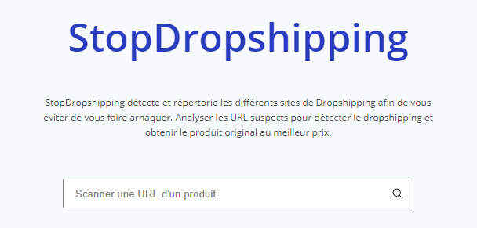

# stopDropshipping

<h4 align="center">Site qui détecte et répertorie les différents sites de Dropshipping afin d'obtenir le produit original au meilleur prix</h4>

<p align="center">
  <a href="#Fonctionnalités">Fonctionnalités</a> |
  <a href="#Utilisation">Utilisation</a> |
  <a href="#Licence">Licence</a> |
  <a href="#Contactez-moi">Contactez-moi</a> |
  <a href="https://ronanren.github.io" target="_blank">Mon site personnel</a> 
</p>

## Lien : <a href="http://stopdropshipping.net">stopdropshipping.net</a>

# Fonctionnalités

- Scanner une URL d'un produit susceptible d'être du dropshipping
- Détecte si c'est du dropshipping et propose un lien pour obtenir le produit au meilleur prix
- Enregistre les différents sites de dropshipping scannés : <a href="https://github.com/ronanren/stopDropshipping/blob/main/database.sql">database.sql</a>

<p align="center">
    
</p>

# Utilisation

```bash
# Cloner ce dépôt
$ git clone https://github.com/ronanren/stopDropshipping

# Configurer le fichier de configuration
$ mv settings.default.json settings.json

# Accéder au dossier
$ cd stopDropshipping/home/

# Installer toutes les dépendances
$ npm install

# Lancer le serveur web
$ node app.js
```

# Licence

<a href="https://github.com/ronanren/stopDropshipping/blob/main/LICENSE" target="_blank">MIT</a>

# Contactez-moi

**Twitter** : <a href="https://twitter.com/Ronanren" target="_blank">@Ronanren</a>
